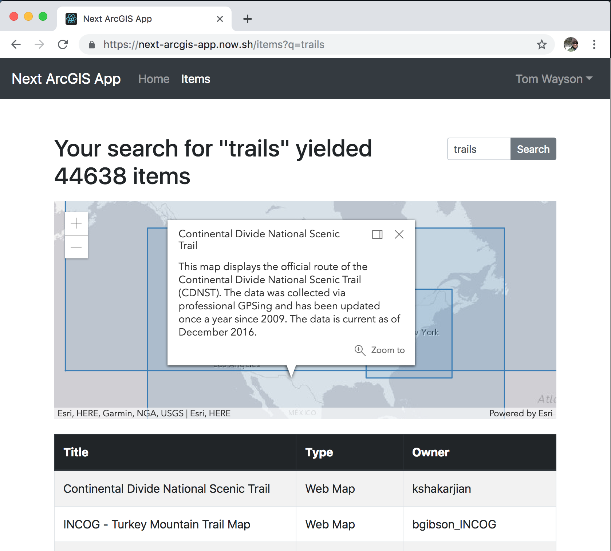

# next-arcgis-app

An example of how to use the [ArcGIS] platform in an application built with [Next.js].

[View it live!](https://next-arcgis-app.now.sh/)

This application uses [arcgis-rest-js](https://esri.github.io/arcgis-rest-js/) to authenticate users and search for items and the [ArcGIS API for JavaScript](https://developers.arcgis.com/javascript/) (via [esri-loader]) to show the extents of those items on a map.

This is a [React] port of [ambitious-arcgis-app-2018](https://github.com/mjuniper/ambitious-arcgis-app-2018/). See that repository for more information on the motivation behind this application.

See [create-arcgis-app](https://github.com/tomwayson/create-arcgis-app) a port of the same application built with [create-react-app](https://facebook.github.io/create-react-app/) instead of Next.js.

See the [Next.js documentation](https://nextjs.org/docs#how-to-use) for more information on how to run this application locally after cloning the repository.

[next.js]: https://nextjs.org/
[arcgis]: https://www.arcgis.com/
[esri-loader]: https://github.com/Esri/esri-loader
[react]: https://reactjs.org/
